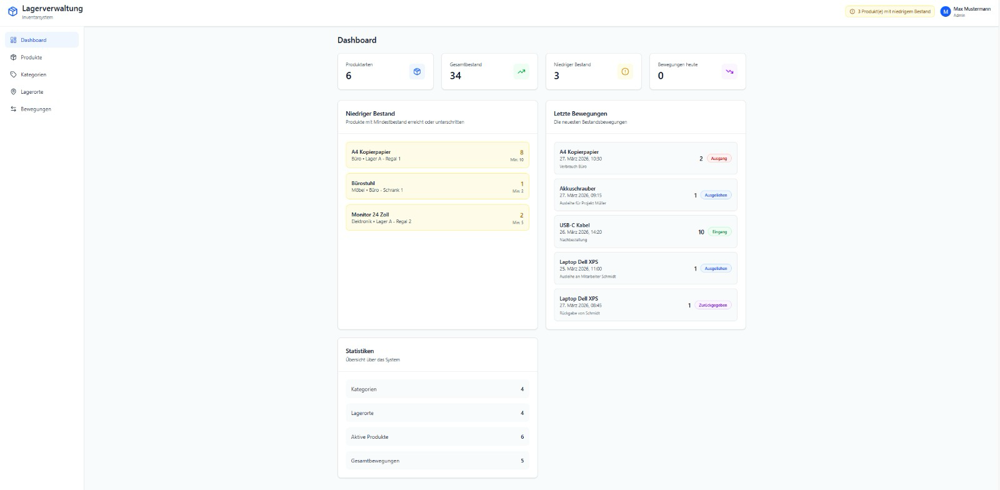
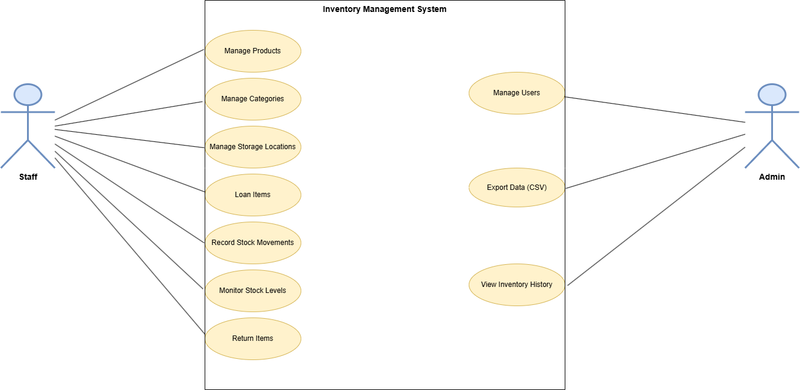
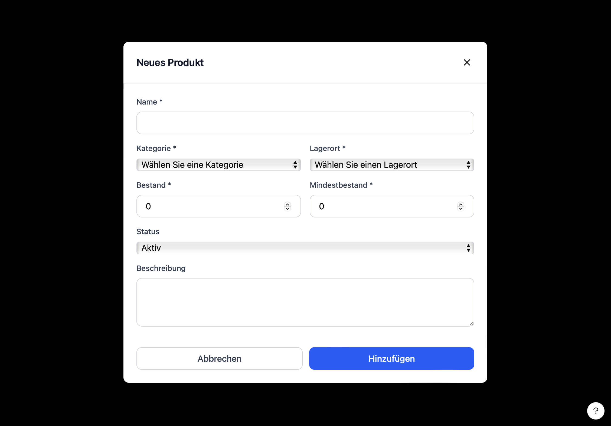
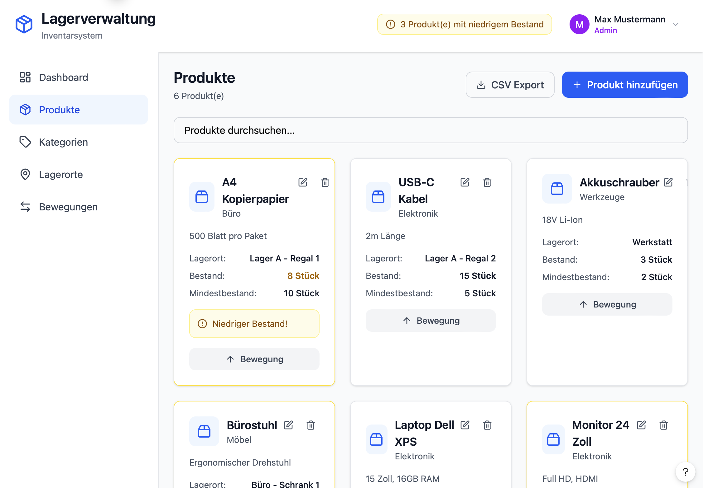
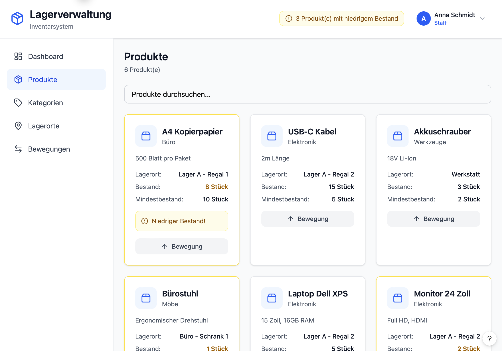
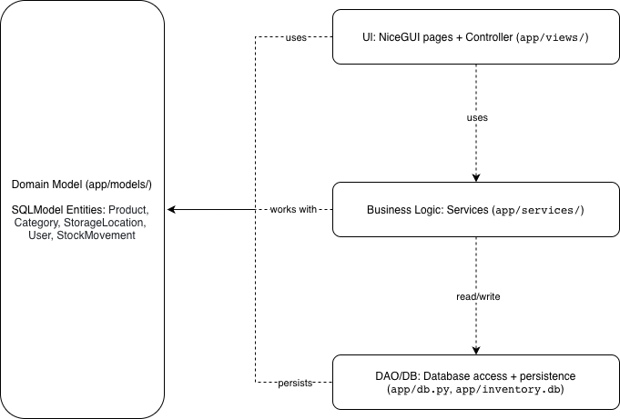
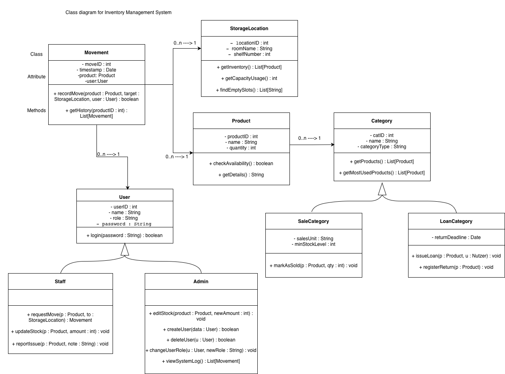
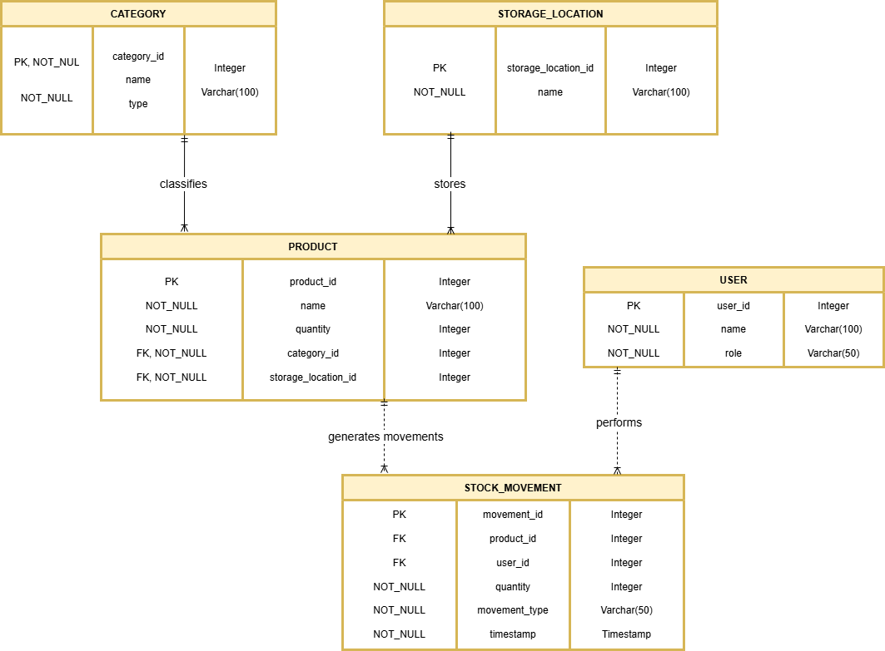

# Inventory Management Projekt - Dokumentation Vorlage

# 📦 Inventory Management Project



---

Dieses Projekt wurde im Rahmen des Moduls Objektorientierte Programmierung im Studiengang Wirtsachtsinformatik an der FHNW entwickelt. Ziel des Projekts ist die Konzeption und Umsetzung eines strukturierten Backend-Systems unter Einsatz moderner Python-Technologien, klarer Architekturprinzipien sowie einer ORM-basierten Datenbankanbindung.

---

## 📝 Application Requirements

In small and medium-sized enterprises, inventory management is often performed manually or with inadequate tools. This leads to:
- Inconsistent data
- Lack of transparency in stock levels
- Poor traceability of movements

A structured system is necessary to store and manage data reliably.

---

### 📖 Scenario

The application allows users to:

- Manage products, categories, and storage locations  
- Record inventory movements  
- Track stock levels and detect low stock  
- Manage loans and returns of items  
- Store all data in a relational database  
- Export data for reporting purposes  

---

## 📖 User Stories

### 1. Manage Products
**As a user, I want to create and manage products.**

- **Inputs:** Product name, category, storage location 
- **Outputs:** Stored product

___

### 2. Manage Categories and Storage Locations
**As a user, I want to define categories and storage locations.**

- **Input:** Category/storage location data
- **Output:** Stored entries

---

### 3. Record Inventory Movements
**As a user, I want to document movements in the inventory.**

- **Input:** Product, quantity, user
- **Output:** Movement record

---

### 4. Manage Users
**As a user, I want to manage users.**

- **Input:** User data
- **Output:** Stored user

---

### 5. Monitor Low Stock
**As a user, I want to receive alerts when stock levels are low so that I can reorder items in time.**

- **Inputs:** Product ID, current quantity, minimum stock level.
- **Outputs:** Visual low stock warning in the UI.

---

### 6. Loan and Return Items
**As a staff member, I want to borrow and return products to track their current usage.**

- **Inputs:** Product, staff member (user), return deadline.
- **Outputs:** Updated movement record and loan status.

---

### 7. Export Data (Admin only)
**As an admin, I want to export product lists and movement data to CSV for external reporting.**

- **Inputs:** Selection of data (Products or Movements), date range. 
- **Outputs:** Generated CSV file.

---

### 8. View Inventory History
**As an admin, I want to see a log of all past movements to track who changed what and when.**

- **Inputs:** Product ID or User ID.
- **Outputs:** List of movements with timestamps and responsible users.

---

### 9. Manage Specific Categories (Sub-types)
**As an admin, I want to define if a category is for sale or for loan to apply different rules.**

- **Inputs:** Category name, type (SaleCategory or LoanCategory), specific attributes like return deadline or min stock level.
- **Outputs:** Specialized category entry.

---

## 🧩 Use Cases



### Main Use Cases

- Manage inventory entities (CRUD)  
- Process goods transactions (in/out)  
- Manage loans and returns  
- Audit and export history (admin)  
- User authentication and roles  

### Actors

- Staff
- Admin

---

### Wireframes / Mockups






---

## 🏛️ High level package diagram

## 🏛️ Architecture


### Layers

- **Presentation Layer (NiceGUI):** UI components and user interaction  
- **Application Layer (Services):** business logic and validation  
- **Persistence Layer:** database access via ORM  

### Layer Responsibilities

- **Views:** handle UI and user interaction  
- **Services:** implement business rules and workflows  
- **Models:** represent domain entities and relationships  
- **Database:** manage persistence and connections  

### Design Decisions

- Separation of concerns
- Modular and extensible structure
- Use of an ORM (SQLModel)
- Backend-first approach
- Preparation for future UI integration

### Patterns Used

- Layered architecture
- ORM pattern
- Repository-like structure

---
## 🗄️ Database and ORM



The application uses **SQLModel** to map domain objects to a SQLite database.

### Entities

- `Product`
- `Category`
- `StorageLocation`
- `User`
- `StockMovement`

## Relationships

### 1. One-to-Many (1→n)

- `Category` → `Product`: One category (e.g., "Electronics") contains many products.
- `StorageLocation` → `Product`: One shelf or room holds many different items.
- `User` → `StockMovement`: One person can perform many stock changes.
- `Product` → `StockMovement``: One item has a long history of many ins and outs.

### 2. Inheritance ("Is-A")

- `User` ← `Admin` / `Staff`: An Admin is a User with extra permissions.
- `Category` ← `SaleCategory` / `LoanCategory`: A LoanCategory is a Category with a return deadline.

---

## ✅ Project Requirements

---

### 1. Browser-based App (NiceGUI)

The application interacts with the user via a modern web interface. Users can:
- Navigate a Dashboard: View real-time stock statistics and low-stock warnings.
- Manage Inventory: Create and edit products, categories, and storage locations.
- Record Movements: Perform "Check-in/Check-out" (Increase/Decrease stock) or "Loan/Return" operations.
- Generate Reports: Receive an inventory summary or movement log generated as a CSV file.

**Architecture note:** The browser is a thin client; UI state and business logic (e.g., role-based access and stock calculations) live on the server-side NiceGUI app.

### 2. Data Validation

The application validates all user input to ensure data integrity and a smooth user experience.
These checks prevent crashes and guide the user to provide correct input, matching the validation requirements:
- Availability Checks: Prevents reducing stock below zero and validates minimum stock levels.
- Role-Based Access: Ensures only Admins can delete data or manage users, while Staff can only view and move items.
- Format Validation: Ensures product quantities are positive integers and return deadlines are valid future dates.

### 3. Database Management

All relevant data is managed via an ORM (SQLModel). This ensures a clean separation between the database and the Python code. Key entities managed include:
- Users: Admin and Staff accounts with encrypted credentials.
- Products & Categories: Managing the relationship between items and their classification (Sale vs. Loan).
- Movements: A complete audit trail linking every stock change to a specific user and timestamp.

### Technology

- Python 3.x  
- NiceGUI  
- SQLModel  
- SQLAlchemy
- pytest  

---

### 📚 Libraries Used

- **nicegui** – UI framework  
- **sqlmodel** – ORM  
- **sqlalchemy** – database toolkit  
- **python-dotenv** – configuration  
- **pytest** – testing  
- **pytest-cov** – coverage  
- **csv / pandas** – data export  


---

## 📂 Repository Structure

```text
.
├── README.md
├── app
│   ├── db.py
│   ├── docs
│   │   └── ui-images
│   ├── init_db.py
│   ├── main.py
│   ├── models
│   │   ├── __init__.py
│   │   ├── category.py
│   │   ├── storagelocation.py
│   │   ├── movement.py
│   │   ├── product.py
│   │   └── user.py
│   ├── seed.py
│   ├── services
│   │   ├── inventory_service.py
│   │   ├── product_service.py
│   │   └── user_service.py
│   ├── tests
│   └── views
│       ├── add_product.py
│       ├── dashboard.py
│       ├── movement.py
│       ├── product_list.py
│       └── ui.py
├── inventory.db
└── requirements.txt
```
---

### How to Run

> 🚧 Adjust to your project.

### 1. Project Setup
- Python 3.13 (or the course version) is required
- Create and activate a virtual environment:
   - **macOS/Linux:**
      ```bash
      python3 -m venv .venv
      source .venv/bin/activate
      ```
   - **Windows:**
      ```bash
      python -m venv .venv
      .venv\Scripts\Activate
      ```
- Install dependencies:
   ```bash
   pip install -r requirements.txt
   ```

### 2. Configuration
- Ensure the SQLite database is available.
- If needed, initialize and seed the database:
   ```bash
   python app/init_db.py
   python app/seed.py
   ```

### 3. Launch
- Start the NiceGUI app:
   ```bash
   python app/main.py
   ```
- Open the URL printed in the console.

### 4. Usage (document as steps)

> 🚧 Describe the main application workflows


1. Open the dashboard in the browser
2. Create categories and storage locations
3. Add new products and assign them
4. Record stock movements (check-in / check-out)
5. Perform loan and return operations
6. Monitor low stock warnings
7. Export data to CSV (admin only)

> 🚧 Add UI screenshots of the main screens (dashboard, products, movements)


---

## 🧪 Testing

The project includes automated unit and service-level tests implemented with pytest.

**Test Scope:**
Overall 28 automated tests were implemented and executed successfully.
The tests cover:
- CategoryServices
- LocationServices
- ProductServices
- UserService
- MovementService

**Tested Functionality:**
The following functionalities were tested:
- Category creation, update, and deletion
- Storage location management
- Product creation and validation
- Product availability checks
- User authentication and role validation
- Stock movement creation
- Validation of invalid product, user, and location references
- Prevention of invalid stock movements
- Database persistence and service logic validation

**Test Enviroment:**

The test use:
- pytest
- SQLite in-memory database
- SQLModel ORM
- pytest fixtures for isolated test data

**Test Execution:**

Command used to execute all tests:
python -m pytest app/tests -v

**Test Result:**
- 28 tests passed
- 0 failed
- 0 errors

## Testing Screenshots

### Categories Page


**Test Case Documentation:**
The project documentation includes:
- detailed test cases
- automated testing reports
- pytest execution screenshots
The documentation files are available in:
app/docs

**Template for writing test cases:**
1. Test case ID – unique identifier (e.g., TC_001)
2. Test case title/description – What is the test about?
3. Preconditions – Requirements before executing the test
4. Test steps – Actions to perform
5. Test data/input
6. Expected result
7. Actual result
8. Status – pass or fail
9. Comments – Additional notes or detected issues

### Automated Test Overview


### Example Test Cases


---

## 👥 Team & Contributions

| Name            | Contribution          |
|-----------------|-----------------------|
| Mahmut Altun    | NiceGUI UI            |
| Josselyn Cabrera| Database & ORM        |
| Nataliia Zvarych| Business logic        |
| Aydin Ada       | Documentation, Testing|


---


## 📝 License

This project is provided for **educational use only** as part of the Advanced Programming module.


  

